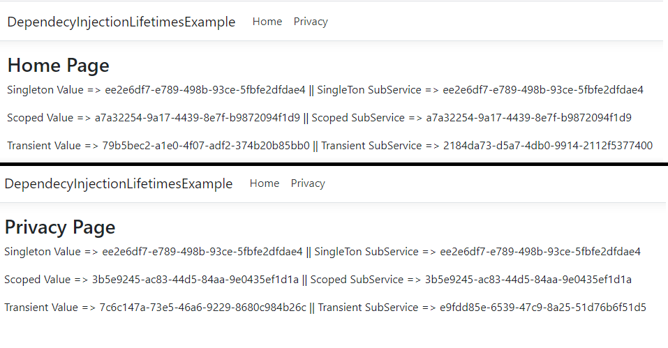

<h1>Exemplo Prático para Tempo de Vida de Injeção de Depência (IOC)</h1>

O tempo de vida pode mudar um pouco de acordo com a maneira que é utilizada.

<h3> #Singleton </h3>

Uma única instância é utlizado durante todo tempo de vida da aplicação. 

<h3> #Scoped </h3>

Uma instância é criado e utilizado por todo pipeline na mesma requisição.

<h3> #Transient </h3>

A cada vez que é injetado pela framework, é criado uma nova instância.

  É possível analisar o funcionamento da maneira que é demontrado à seguir.

Foi criado um serviço e um subserviço para cada tempo de vida, sendo que o subserviço retorna o atributo da injeção do serviço principal, no serviço principal foi criado
uma Guid que ao criar uma instância dessa classe, por padrão atribui uma nova Guid ao campo Value.

    public class ScopedService
    {
        private string Value { get; set; } = Guid.NewGuid().ToString();

        public string GetValue()
        {
            return Value;
        }
    }
    
    
    public class ScopedSubService
    {
        private readonly ScopedService _scopedService;
        
        public ScopedSubService(ScopedService scopedService)
        {
            _scopedService = scopedService;
        }

        public string GetValue()
        {
            return _scopedService.GetValue();
        }
    }
   
  

  No método Index e Privacy da Controller é chamado todos os serviços e subserviços.
  
        public IActionResult Index()
        {
            ViewBag.SingletonService = _singletonService.GetValue();
            ViewBag.ScopedService = _scopedService.GetValue();
            ViewBag.TransientService = _transientService.GetValue();

            ViewBag.SingletonSubService = _singletonSubService.GetValue();
            ViewBag.ScopedSubService = _scopedSubService.GetValue();
            ViewBag.TransientSubService = _transientSubService.GetValue();

            return View();
        }
        
        public IActionResult Privacy()
        {
            ViewBag.SingletonService = _singletonService.GetValue();
            ViewBag.ScopedService = _scopedService.GetValue();
            ViewBag.TransientService = _transientService.GetValue();

            ViewBag.SingletonSubService = _singletonSubService.GetValue();
            ViewBag.ScopedSubService = _scopedSubService.GetValue();
            ViewBag.TransientSubService = _transientSubService.GetValue();

            return View();
        }
  

  
  
O resultado é o que acontece logo abaixo, no tempo de vida <strong>Singleton</strong>, o Guid criado é mesmo utilizado em todos os serviços durante as duas requisições, 
  tanto no Index, quanto no Privacy, o <strong>Scoped</strong> manteve seu valor durante a mesma requisição, serviço e no subserviço, porém em outra requisição (Privacy) 
  gerou uma nova instância e consequentemente uma nova Guid, no <strong>Transient</strong> apesar de estar na mesma requisição, em chamadas diferentes foi criado uma 
  nova instância e assim gerou uma nova Guid durante a chamada do SubServiço.

  
  
  
